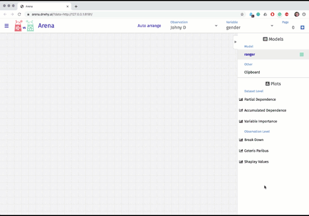
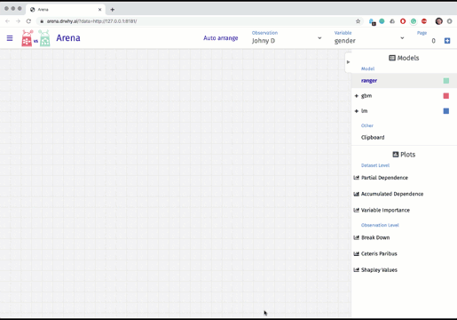

```{r, include = FALSE}
knitr::opts_chunk$set(
  collapse = TRUE,
  comment = "#>",
  message = FALSE,
  eval = FALSE
)
```

# Setup

In this example we will use `titanic_imputed` data to show some examples for the `ArenaR` library.

We will create a random forest model that will predict chances of survival and then use `Arena` to do global exploration of this model.

Let's see the data.

```{r, eval=FALSE}
library("dplyr")
library("DALEX")

head(titanic_imputed)
```

# Basic use of Arena - Single Model, Global Explanations

Arena offers the possibility to explore any ML model. We will start this example with one model and global explanations.

## Train a model

We'll use the `ranger` package for this example. With its help, we will build a random forest model. 

```{r, eval=FALSE}
library("ranger")

titanic_rf <- ranger(survived ~ ., 
              data = titanic_imputed,
              probability = TRUE, 
              classification = TRUE)
```

## Create an explainer

`ArenaR`, like all packages from the `DrWhy` family, works on unified model wrappers. We will create them with the `explain` function from the `DALEX` package.

```{r, eval=FALSE}
library("DALEX")

titanic_ex <- explain(
	titanic_rf,
	data = titanic_imputed)
```

## Create an Arena and add the model

We are ready to create an arena for comparison and exploration of machine learning models. 

First, we need to create an empty space to explore models with the use of the `create_arena` function. 
Then we can add models to it with the `push_model` function.

We have one model, so let's add it to the arena!

```{r, eval=FALSE}
library("arenar")

titanic_ar <- create_arena(live = TRUE) %>%
	push_model(titanic_ex) 
```

For the pushed model a set of global explanations is calculated. Such as the [Variables importance](https://pbiecek.github.io/ema/featureImportance.html) and [Partial Dependence Plots](https://pbiecek.github.io/ema/partialDependenceProfiles.html) / [Accumulated Local Effects](https://pbiecek.github.io/ema/accumulatedLocalProfiles.html) for each variable.

## Run the live Arena server

We are ready to work with the model interactively.

We can execute the arena object using `run_server` function. 
It will turn R into a server serving data and use the dashboard https://arena.drwhy.ai/ to explore the data. 

```{r, eval=FALSE}
run_server(titanic_ar)
```

The browser will open an interactive tool for model exploration.


# Intermediate use of Arena - Single Model, Global and Local Explanations

Arena allows you to explore the ML model for any instance. To the model built in the previous chapter we will add explanations for three new observations.

## Add local explanations

The arena also supports the exploration of the model at the level of explanations for individual instances. Let's first prepare a data set with three new passengers.

```{r, eval=FALSE}
passangers <- data.frame(
            class = factor(c("1st", "3rd", "1st"), levels = c("1st", "2nd", "3rd", "deck crew",
                        "engineering crew", "restaurant staff", "victualling crew")),
            gender = factor(c("male", "male", "female"), levels = c("female", "male")),
            age = c(8, 42, 12),
            sibsp = c(0, 0, 0),
            parch = c(0, 0, 0),
            fare = c(72, 10, 50),
            embarked = factor(c("Southampton", "Belfast", "Belfast"), levels = c("Belfast",
                        "Cherbourg","Queenstown","Southampton")))
rownames(passangers) = c("Johny D", "Henry", "Mary")
passangers
```
```
        class gender age sibsp parch fare    embarked
Johny D   1st   male   8     0     0   72 Southampton
Henry     3rd   male  42     0     0   10     Belfast
Mary      1st female  12     0     0   50     Belfast
```

Let's add these observations to the arena with the `push_observations` functions.

```{r, eval=FALSE}
titanic_ar <- titanic_ar %>%
	push_observations(passangers) 
```

For these new observations a set of local explanations is calculated. Such as the [Break Down](https://pbiecek.github.io/ema/breakDown.html), [Shapley values](https://pbiecek.github.io/ema/shapley.html) and  [Ceteris Paribus](https://pbiecek.github.io/ema/ceterisParibus.html) for each variable.

## Run the live Arena server

The updated arena object can be viewed again by running the `run_server` function on it.

```{r, eval=FALSE}
run_server(titanic_ar)
```

The browser will open an interactive tool for model exploration.




# Advanced use of Arena - Multiple Models, Global and Local Explanations

The most important feature of the `Arena` is the ability to compare any number of ML models regardless of their complexity and internal structure.

We will use the model created in the previous section to demonstrate this functionality.

## Create more models

For the titanic data let's build a gradient boosting model and a generalized linear model. Together with the ranger model, these are three models with a completely different structures. This will make comparing them much more interesting.

The linear model is additive, the gradient boosting model can have deep interactions. Let's build these models and then compare them.

```{r, eval=FALSE}
titanic_glm <- glm(survived ~ ., data = titanic_imputed, family = "binomial")

library("gbm")

titanic_gbm <- gbm(survived ~ ., data = titanic_imputed, n.trees = 500)
```

## Create explainers

Since these models have different structures, we need to standardize the way we can access them. We will use the explain function for this.

```{r, eval=FALSE}
titanic_egb <- explain(titanic_gbm,
    data = titanic_imputed)
titanic_elm <- explain(titanic_glm,
    data = titanic_imputed)
```

## Add more models to the Arena

We can add more models to the Arena with the `push_model` function. It is very easy.

```{r}
titanic_ar <- titanic_ar %>%
	push_model(titanic_egb) %>%
	push_model(titanic_elm)
```

## Run the live Arena server

The updated arena object can be viewed again by running the `run_server` function on it.

```{r, eval=FALSE}
run_server(titanic_ar)
```

The browser will open an interactive tool for model exploration.




# Serverless version of the Arena

In the above example, we called `create_arena(live = TRUE)` so all the necessary explanations were calculated on the spot when they were needed.
However, this requires a working R in the backend. 

You can also run the arena in serverless mode. Just initialize it with the parameter `create_arena(live = FALSE)`. In this case all important statistics will be pre-calculated and the arena can be used in serverless mode.

Here is the full example that shows how to use Arena in the this mode.

```{r, eval=FALSE}
create_arena() %>%
	push_model(titanic_ex) %>%
	push_model(titanic_egb) %>%
	push_model(titanic_elm) %>%
	push_observations(passangers) %>%
  upload_arena()
```
